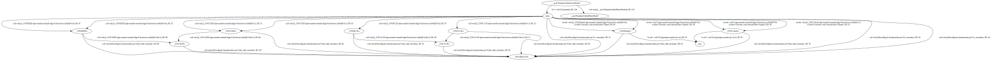

# Build CallGraph

Shows several ways, how you can use PhASAR to build and use a call graph from a LLVM IR module.

You may look at the different C++ source files to see, how you can build a call graph using PhASAR.
You may want to start with [build_llvm_based_icfg.cpp](./build_llvm_based_icfg.cpp).

## Build

This example program can be built using cmake.
It assumes, that you have installed PhASAR on your system. If you did not install PhASAR to a default location, you can specify `-Dphasar_ROOT=your/path/to/phasar` when invoking `cmake`, replacing "your/path/to/phasar" by the actual path where you have installed PhASAR.

```bash
# Invoked from the 02-build-call-graph root folder:
$ mkdir -p build && cd build
$ cmake ..
$ cmake --build .
```

## Test

You can test the example program on the target programs from [llvm-hello-world/target](../../llvm-hello-world/target/).

```bash
# Invoked from the 02-build-call-graph/build folder:
./build-llvm-based-icfg ../../../llvm-hello-world/target/class_hierarchy.ll

./build-llvm-based-call-graph ../../../llvm-hello-world/target/class_hierarchy.ll
```

### Visualizing the CallGraph

The test programs show, how you can export a call-graph to a dot-graph.
You can use the `dot` command-line tool (get this by, e.g., invoking `apt install graphviz` or similar).

The call-graph obtained from the example program on the sample `class_hierarchy.ll` should look similar to this:


